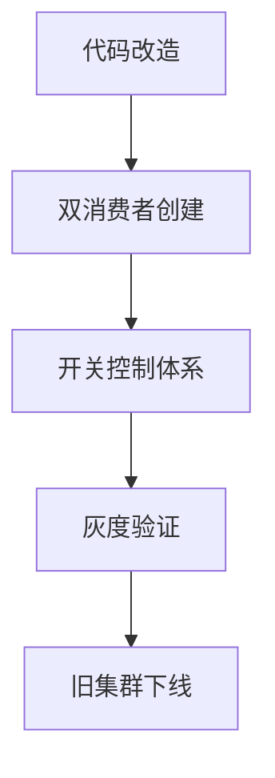

### RocketMQ集群迁移实践与消费者组设计思考

#### 迁移方案实施流程

##### 1、迁移准备阶段

- 新集群环境搭建与验证
- 网络策略配置（跨集群访问白名单、带宽评估）
- 监控告警体系迁移（Dashboard重建、报警规则同步）

##### 2、数据迁移实施

- 生产者端：
  - DBA主导binlog文件抽数
  - 新旧集群双写验证（建议保留7天追溯期）

- 消费者端：
  - 新集群消息堆积监控
  - 消费延迟指标对比（新旧集群差异需<5%）

##### 3、业务方改造

#### 消费者组设计争议点剖析

##### 现状描述

同一消费者组订阅多个Topic：

当前消费模式：ConsumerGroupA 同时消费 TopicX（订单数据）和 TopicY（日志数据）

业务影响：两类消息处理逻辑耦合，导致消费速度受限于处理较慢的业务

##### 技术验证结论

| 维度         | 多Topic共用消费者组  | 独立消费者组       |
| ------------ | -------------------- | ------------------ |
| 消息隔离性   | 差（共享线程池）     | 优（独立资源池）   |
| 扩缩容灵活性 | 整体扩容导致资源浪费 | 按业务压力精准伸缩 |
| 故障影响范围 | 单Topic异常影响全组  | 故障隔离           |
| 监控维度     | 混合指标难以分析     | 独立监控体系       |

---

##### 分析

一、使用不同消费者组的原因

- 消息处理逻辑不一致：如果不同 Topic 的消息处理逻辑不同，使用不同的消费者组可以更好地隔离业务逻辑。例如：
  - TopicA 的消息需要进行复杂的业务处理，而 TopicB 的消息只需要简单的更新操作。
  - 如果使用同一个消费者组，消费者需要同时处理两种不同的逻辑，这会增加代码的复杂性和维护难度。
  
- 更新的 Index 不一致：如果不同 Topic 的消息需要更新不同的 Elasticsearch（ES）索引，使用不同的消费者组可以更方便地管理和维护索引操作。例如：
  - TopicA 的消息需要更新索引 index_a，而 TopicB 的消息需要更新索引 index_b。
  - 如果使用同一个消费者组，消费者需要根据消息的 Topic 动态选择更新的索引，这会增加代码的复杂性，并且可能导致索引更新的错误。

- 消费速度和重试策略不同：不同 Topic 的消息可能有不同的消费速度和重试策略。例如：
  - TopicA 的消息量较大，需要更多的消费者实例来处理。
  - TopicB 的消息量较小，但对消费的可靠性要求更高，需要更严格的重试机制。
  - 使用不同的消费者组可以更灵活地调整消费速度和重试策略，避免不同 Topic 的消息互相影响。

二、使用同一消费者组的风险

- 订阅关系不一致：如果同一个消费者组订阅了多个 Topic，但消费者实例的订阅信息不一致，可能会导致消息分配错误。例如：
  - 消费者实例 A 订阅了 TopicA，而消费者实例 B 订阅了 TopicB。
  - 如果消费者组的订阅信息被覆盖或不一致，可能会导致部分消费者收不到预期的消息，或者收到不属于其订阅范围的消息。

- 消息处理逻辑混乱：如果同一个消费者组需要处理多个 Topic 的消息，消费者需要根据消息的 Topic 动态选择处理逻辑。这会增加代码的复杂性，并且可能导致消息处理的错误。例如：
  - 消费者需要根据消息的 Topic 判断是更新索引 index_a 还是 index_b，如果判断逻辑出错，可能会导致索引更新的错误。

- 资源分配不均衡：如果不同 Topic 的消息量和消费速度差异较大，使用同一个消费者组可能会导致资源分配不均衡。例如：
  - TopicA 的消息量较大，需要更多的消费者实例来处理，而 TopicB 的消息量较小。
  - 如果使用同一个消费者组，可能会导致 TopicA 的消息处理速度较慢，而 TopicB 的消费者实例资源浪费。

总结

- 允许使用同一消费者组：不同的 Topic 用同一个消费者组是允许的，前提是这些 Topic 的消息处理逻辑和消费策略相对一致，并且你能够管理好消费者的资源和逻辑。
- 建议分开：为了更好的管理和扩展性，大多数情况下推荐为不同的 Topic 使用不同的消费者组。这可以避免不同业务逻辑之间的冲突，提高系统的可维护性和稳定性。

#### 其他思考

1. RocketMq消费订阅关系的一致性问题？
2. 不一致会有什么问题，原因是啥？
3. 不同消费实例订阅不同topic & 不同消费者实例订阅相同topic，但不同tag
4. 针对上述问题，如何解决消费者增加tag的情况，默认生产环境分批发布
